## Phylodynamics pipeline for pathogen sequence data
  
**Mukarram Hossain**  

Department of Veterinary Medicine  
University of Cambridge
  
  

<!--- &nbsp; --->

---

### Phylodynamics
 
*"Viral phylodynamics is defined as the study of how epidemiological, immunological, and evolutionary processes act and potentially interact to shape viral phylogenies."*

 
[Volz, Koelle and Bedford (2013)](http://journals.plos.org/ploscompbiol/article?id=10.1371/journal.pcbi.1002947)

---

### Phylodynamic analysis
 
* Serially sampled virus sequences and phylogenies reveal phylodynamic properties
* Frequently use sophisticated software packages:
  + BEAST
  + MrBayes
* [BEAST](http://bmcevolbiol.biomedcentral.com/articles/10.1186/1471-2148-7-214) is cited ~7300 times
  
People use BEAST/MrBayes as a black box

--- 

      

Phylodynamic analysis - issues

--- &vertical

### Datasets with heterogeneity

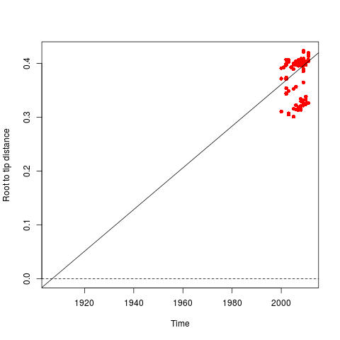&nbsp;

***

### Heterogeneity in phylogeny

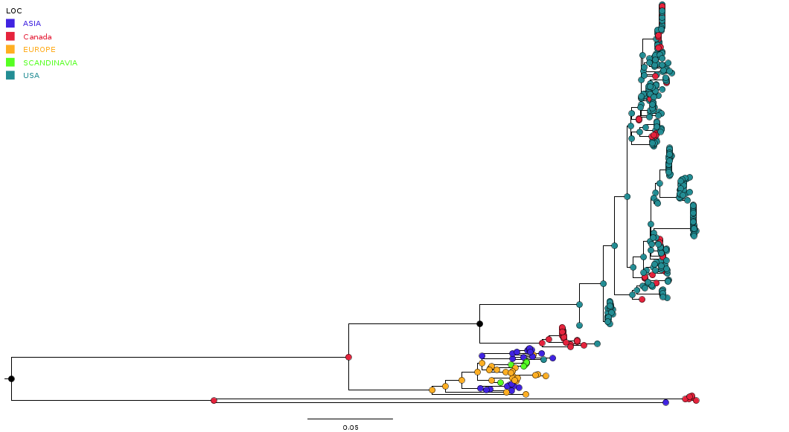&nbsp;

---

### Resource requirements

&nbsp;

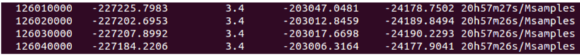&nbsp;

---

### Incorrect model selection
 
* Poor model fit in phylodynamic studies may lead to incorrect estimation
  + [Reid et al. (2014)](http://sysbio.oxfordjournals.org/content/63/3/322.long)
  + [Holmes (2016)](http://jvi.asm.org/content/90/4/2155.full)
  + [Rambaut et al. (2016)](http://ve.oxfordjournals.org/content/2/1/vew007)

 **Prior analysis is recommended before running BEAST**

---

### BEAST 
 
* Rely on Markov Chain Monte Carlo (MCMC) to obtain posterior estimates 
* MCMC is slow to reach stationary distribution for large datasets
* BEAST is an ideal tool for confirmatory analysis
* Not ideal for:
  + model comparison
  + hypothesis testing using goodness of fit  

---

      

Phylodynamic pipeline

---

### Phylopipe
 
* For high throughput analysis of heterochronous pathogen sequence data
* Can be used for three purposes:
  + quality control step
  + exploratory tool to obtain rough estimates
  + to use these estimates as initial conditions in BEAST

---

### PhyloPipe - Tools
 
The following tools are included in the pipeline:
* Alignment - [Pipelign](https://github.com/asmmhossain/pipelign), [Muscle](http://www.drive5.com/muscle/), [Mafft](http://mafft.cbrc.jp/alignment/software/)
* Phylogeny reconstruction - [ExaML](http://sco.h-its.org/exelixis/web/software/examl/index.html), [IQ-TREE](http://www.cibiv.at/software/iqtree/)
* Evolutionary rate estimation - [RTT](https://cran.r-project.org/web/packages/ape/index.html), [TREBLE](http://bioinformatics.oxfordjournals.org/content/23/2/169.full), [LSD](http://www.atgc-montpellier.fr/LSD/)
* Time-stamped phylogeny - [RTT](https://cran.r-project.org/web/packages/ape/index.html), [CHRONOS](https://cran.r-project.org/web/packages/ape/index.html), [LSD](http://www.atgc-montpellier.fr/LSD/)
* Demographic model selection - [GENIE](http://www.cecalc.ula.ve/BIOINFO/servicios/herr1/GENIE/manual.html)
* Population dynamics - [Phylodyn](https://github.com/mdkarcher/phylodyn)
* Detecting asymmetry - [treeImbalance](https://github.com/bdearlove/treeImbalance)

---

### PhyloPipe - workflow

---

      

Case studies

---

### Dengue virus type 1 (Vietnam)
 

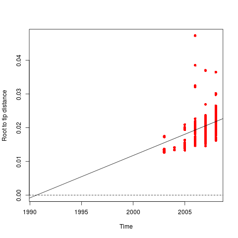

---&vertical

### H3N2 influenza (HA) - Europe
 

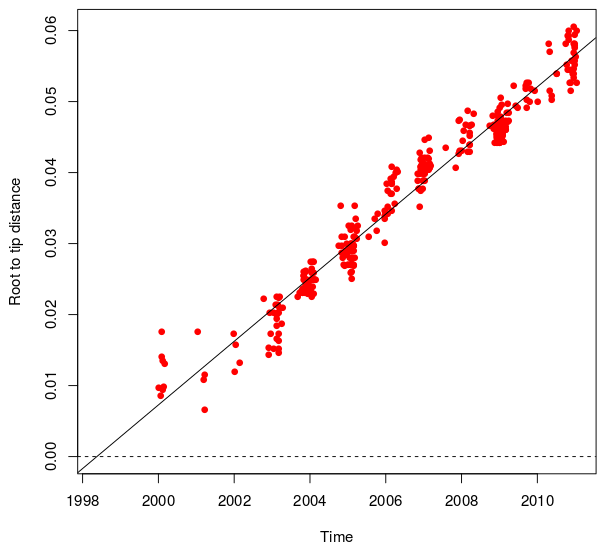

***

### Europe - rates and tMRCA
 
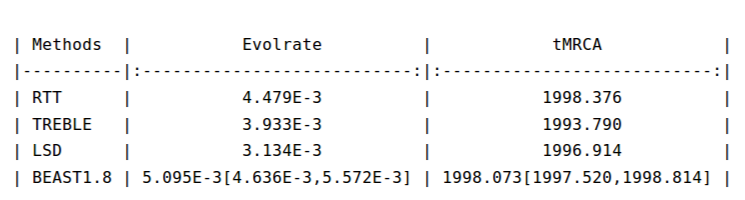

***

### Europe - molecular clock  
 
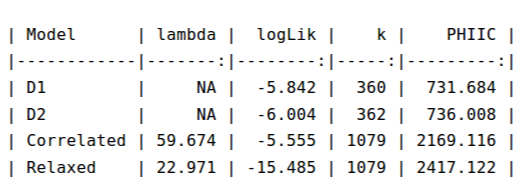

***

### Europe - demographic model
 
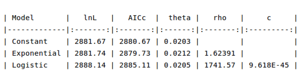

***

### Europe - skyride
 
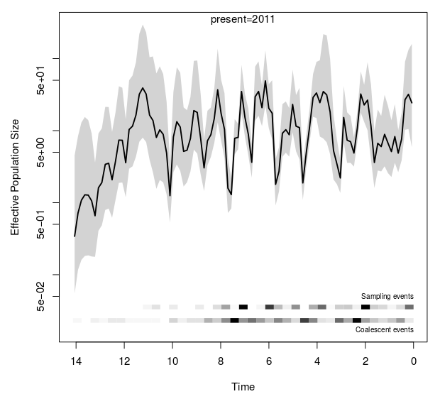

***

### Europe - asymmetry analysis
 
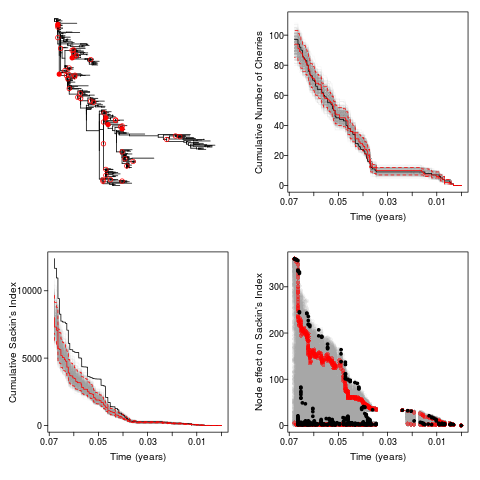

***

### Europe - asymmetry analysis
 

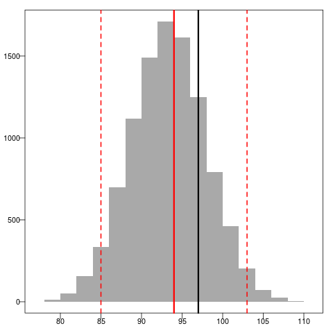

Distribution of number of cherries

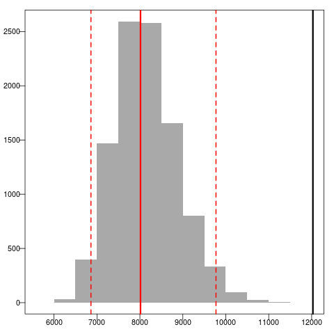

Disribution of Sackin's index

***

### Europe - initial conditions
 
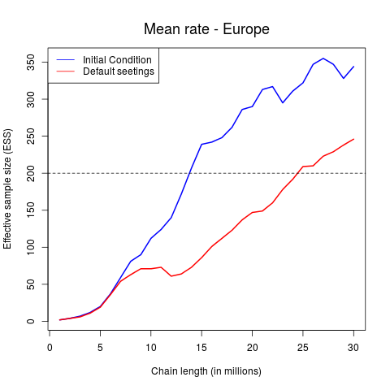

---

### PhyloPipe - summary
 
* Quick and approximate phylodynamic estimation
* Compatible (??) estimation of parameters 
* Ease of use

---

### Future works
 
* Include more analysis tools 
* Set up web service with analysis summary
* Develop open platform distributed application

---

### Acknowledgements
 
* Simon Frost
* Bethany Dearlove
* Fei Xiang

---

 

---

  

